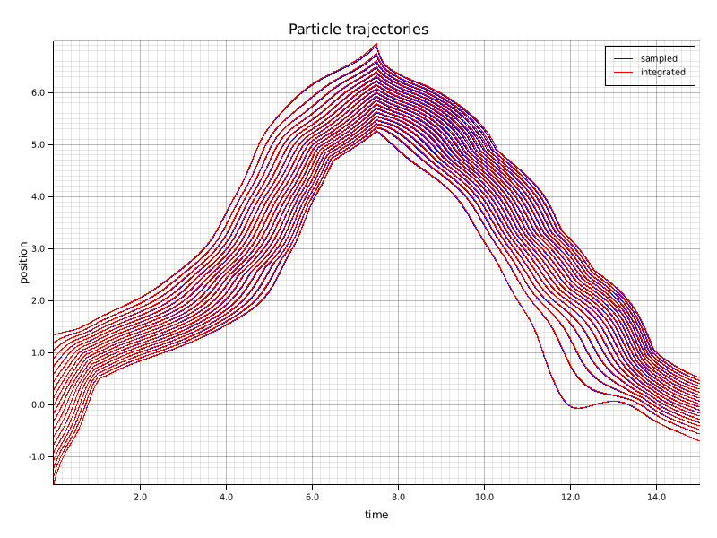

# Particle methods for 1D conservation laws

[](https://crates.io/crates/cons-laws)
[](https://docs.rs/cons-laws)
[](https://github.com/FedericoStra/cons-laws/actions/workflows/rust.yml)
[](https://choosealicense.com/licenses/mit/)


This crate implements the deterministic particle schemes described in the article
*Entropy solutions of non-local scalar conservation laws with congestion via deterministic particle method*, E. Radici, F. Stra (2021), [https://arxiv.org/abs/2107.10760](https://arxiv.org/abs/2107.10760).

You can cite the article as

```
@online{RadiciStra2021,
    title={Entropy solutions of non-local scalar conservation laws with congestion via deterministic particle method}, 
    author={Emanuela Radici and Federico Stra},
    year={2021},
    eprint={2107.10760},
    archivePrefix={arXiv},
    primaryClass={math.AP},
    url={https://arxiv.org/abs/2107.10760}
}
```

This is a reimplementation in Rust of the Julia package [ConservationLawsParticles.jl](https://github.com/FedericoStra/ConservationLawsParticles.jl).

The goal of this crate is to solve non-local conservation laws with congestion of the form

    ∂ₜρ + divₓ[ρ⋅v(ρ)⋅(V - ∂ₓW⋆ρ)] = 0

via deterministic particle schemes.
Plotting the trajectories of the particles produces images such as 
